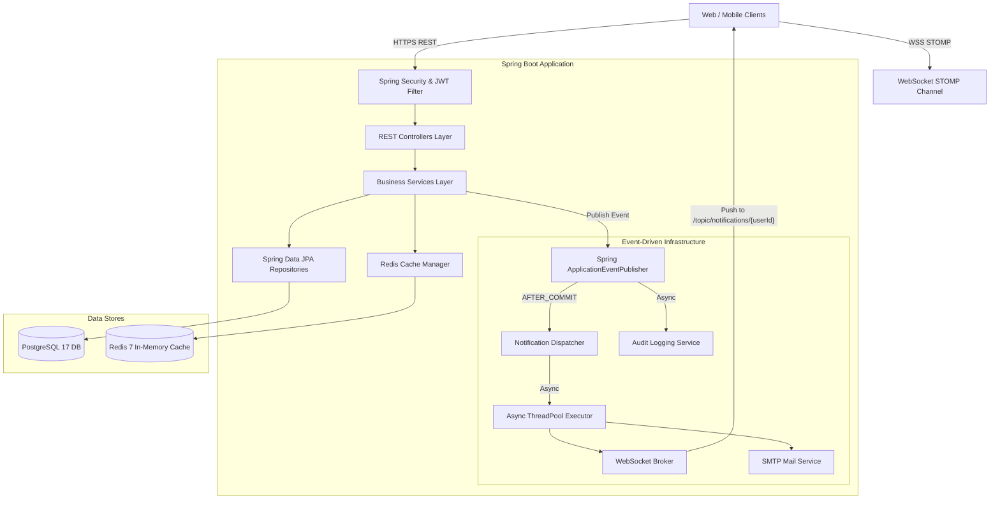
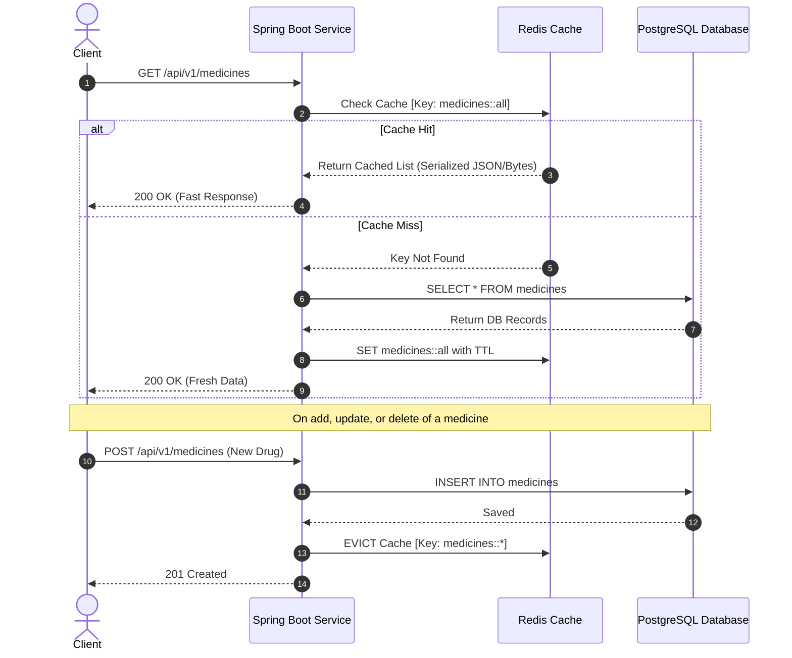
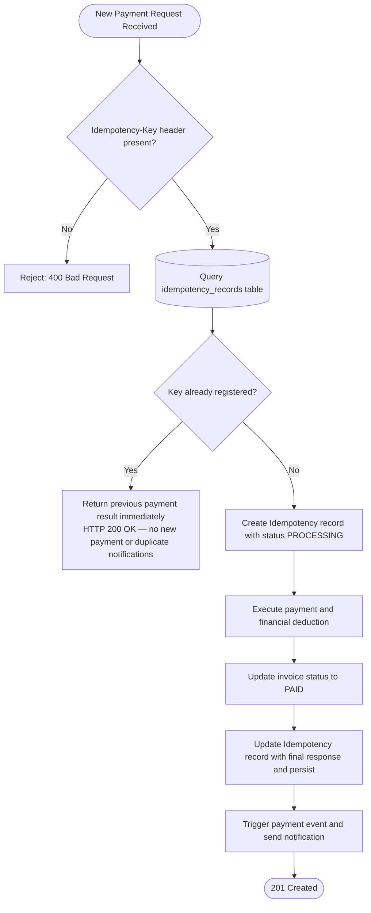

# 🏥 Enterprise Hospital Management System

[](https://openjdk.org/)
[](https://spring.io/projects/spring-boot)
[](https://www.postgresql.org/)
[](https://redis.io/)
[](https://www.docker.com/)
[](https://spring.io/projects/spring-security)
[](https://stomp.github.io/)
[](https://swagger.io/)

---

## 📌 Table of Contents

1. [Project Overview](#-project-overview)
2. [Architecture & Design Patterns](#️-architecture--design-patterns)
3. [Database Schema & ERD](#-database-schema--erd)
4. [Tech Stack](#️-tech-stack)
4. [Directory & Package Structure](#-directory--package-structure)
5. [Core Business Modules](#-core-business-modules)
   - [1. Authentication & Security](#1-authentication--security)
   - [2. Doctors, Schedules & Branches](#2-doctors-schedules--branches)
   - [3. Patient Management](#3-patient-management)
   - [4. Appointments & Concurrency](#4-appointments--concurrency)
   - [5. Medical Records & File Management](#5-medical-records--file-management)
   - [6. Prescriptions & Medicines](#6-prescriptions--medicines)
   - [7. Laboratory System](#7-laboratory-system)
   - [8. Billing & Idempotent Payments](#8-billing--idempotent-payments)
   - [9. Real-Time Notifications & WebSocket](#9-real-time-notifications--websocket)
   - [10. Schedulers & Background Jobs](#10-schedulers--background-jobs)
   - [11. Audit Logging](#11-audit-logging)
6. [Redis Caching](#-redis-caching)
7. [Idempotency Pattern](#-idempotency-pattern)
8. [WebSocket Protocol & Security](#-websocket-protocol--security)
9. [Role-Based Access Control & IDOR Protection](#-role-based-access-control--idor-protection)
10. [REST API Endpoints Reference](#-rest-api-endpoints-reference)
11. [Environment Configuration & Profiles](#️-environment-configuration--profiles)
12. [Running with Docker & Docker Compose](#-running-with-docker--docker-compose)
13. [Monitoring & Health Checks (Actuator)](#-monitoring--health-checks-actuator)
14. [Comprehensive Testing & Quality Assurance](#-comprehensive-testing--quality-assurance)
15. [Global Error Handling](#️-global-error-handling)
16. [Author & License](#-author--license)

---

## 🌟 Project Overview

The **Hospital Management System** is a fully-featured, enterprise-grade backend built with **Spring Boot** and **Java 21**. It is designed to manage the daily medical, administrative, and financial operations of multi-branch hospitals and medical centers with high precision and reliability.

### Core Objectives

- **Strict Security & Medical Compliance:** Full protection of patient data privacy and prevention of IDOR (Insecure Direct Object Reference) vulnerabilities through rigorous record-ownership validation.
- **High Performance & Scalability:** Leveraging non-blocking event publishing and distributed caching via **Redis** to minimize database load.
- **Financial Reliability:** Support for multi-method instant payments with strict **Idempotency** enforcement to prevent duplicate charges under any circumstances.
- **Real-Time Concurrency:** Broadcasting medical notifications and appointment updates via **WebSocket (STOMP)** and email in a decentralized, non-blocking manner using an Asynchronous & Transactional Event-Driven architecture.
- **Production-Ready:** Containerized with Docker using a non-root user, environment-separated configuration via Spring Profiles (`dev` / `prod`), and live health indicators via **Spring Boot Actuator**.

---

## 🏗️ Architecture & Design Patterns

The project follows a **Layered Architecture** backed by an **Event-Driven Architecture** to achieve maximum Separation of Concerns.



### Key Design Patterns

1. **Domain-Driven Module Structure:** Each feature (Appointment, Billing, Patient, Prescription, etc.) is isolated in its own package containing the Entity, Repository, Service, Controller, and DTOs.
2. **Transactional Outbox via `@TransactionalEventListener(phase = AFTER_COMMIT)`:** Notifications, emails, and WebSocket messages are sent only after the medical or financial transaction has been successfully committed to the database (ACID guarantee).
3. **Fail-Safe Asynchronous Execution:** All side-effect operations (email sending, audit logging) run in a separate `@Async` Thread Pool. If the SMTP server or WebSocket connection fails, the core medical operation completes successfully without interruption.
4. **Cache-Aside Pattern:** Redis caches results of frequently-read, slowly-changing queries (e.g., medicines list, lab tests list), with automatic cache eviction on any write or delete operation.
5. **Idempotent Consumer Pattern:** Financial operations are protected via an `Idempotency-Key` header to prevent duplicate payment processing.

---

## 📊 Database Schema & ERD

The diagram below reflects the actual JPA entity relationships in the project.

```mermaid
erDiagram
    USERS ||--o| PATIENTS : "has one profile"
    USERS ||--o| DOCTORS : "has one profile"
    USERS ||--o{ NOTIFICATIONS : "receives"
    USERS ||--o{ AUDIT_LOGS : "generates"

    DOCTORS }o--o{ BRANCHES : "works at (via DOCTOR_BRANCHES)"
    DOCTOR_BRANCHES ||--o{ DOCTOR_SCHEDULES : "has schedule"
    DOCTOR_BRANCHES ||--o{ APPOINTMENTS : "held at"

    DOCTORS ||--o{ APPOINTMENTS : "attends"
    PATIENTS ||--o{ APPOINTMENTS : "books"

    APPOINTMENTS ||--o| MEDICAL_RECORDS : "produces one"
    APPOINTMENTS ||--o| PRESCRIPTIONS : "has one"
    APPOINTMENTS ||--o{ LAB_ORDERS : "triggers"
    APPOINTMENTS ||--o{ INVOICES : "billed via"

    PRESCRIPTIONS ||--o{ PRESCRIPTION_ITEMS : "contains"
    PRESCRIPTION_ITEMS }o--|| MEDICINES : "references"

    LAB_ORDERS ||--o| LAB_RESULTS : "yields one"
    LAB_ORDERS }o--|| LAB_TESTS : "of type"

    PATIENTS ||--o{ INVOICES : "billed to"
    INVOICES ||--o{ INVOICE_ITEMS : "contains"
    INVOICES ||--o{ PAYMENTS : "settled by"
    INVOICE_ITEMS }o--o| LAB_ORDERS : "linked to"
    INVOICE_ITEMS }o--o| PRESCRIPTION_ITEMS : "linked to"

    PAYMENTS ||--o| IDEMPOTENCY_RECORDS : "guarded by"

    PATIENTS ||--o{ MEDICAL_FILES : "owns"
    MEDICAL_FILES }o--o| PRESCRIPTIONS : "attached to"
    MEDICAL_FILES }o--o| LAB_RESULTS : "attached to"

    USERS {
        bigint id PK
        string email UK
        string password
        string firstName
        string lastName
        string role "ADMIN DOCTOR RECEPTIONIST PATIENT"
        boolean enabled
        datetime createdAt
    }
    PATIENTS {
        bigint id PK
        bigint user_id FK UK
        string nationalId UK
        string phone
        date dateOfBirth
        string gender
        string address
    }
    DOCTORS {
        bigint id PK
        bigint user_id FK UK
        string specialization
        string licenseNumber UK
        string phone
        string bio
    }
    BRANCHES {
        bigint id PK
        string name UK
        string address
        string phone
        string email UK
        boolean enabled
    }
    DOCTOR_BRANCHES {
        bigint id PK
        bigint doctor_id FK
        bigint branch_id FK
        boolean enabled
    }
    DOCTOR_SCHEDULES {
        bigint id PK
        bigint doctor_branch_id FK
        string dayOfWeek
        time startTime
        time endTime
    }
    APPOINTMENTS {
        bigint id PK
        bigint doctor_id FK
        bigint patient_id FK
        bigint doctor_branch_id FK
        date date
        time startTime
        time endTime
        string status "PENDING CONFIRMED COMPLETED CANCELLED"
        string notes
    }
    MEDICAL_RECORDS {
        bigint id PK
        bigint appointment_id FK UK
        bigint patient_id FK
        bigint doctor_id FK
        string diagnosis
        string symptoms
        string notes
        string treatment
    }
    MEDICINES {
        bigint id PK
        string name UK
        string description
        boolean active
        datetime createdAt
    }
    PRESCRIPTIONS {
        bigint id PK
        bigint patient_id FK
        bigint doctor_id FK
        bigint appointment_id FK UK
        string notes
        datetime prescribedAt
    }
    PRESCRIPTION_ITEMS {
        bigint id PK
        bigint prescription_id FK
        bigint medicine_id FK
        string dosage
        string frequency
        string duration
        string instructions
    }
    LAB_TESTS {
        bigint id PK
        string name UK
        string description
        boolean active
        datetime createdAt
    }
    LAB_ORDERS {
        bigint id PK
        bigint patient_id FK
        bigint doctor_id FK
        bigint appointment_id FK
        bigint lab_test_id FK
        string status "ORDERED IN_PROGRESS COMPLETED CANCELLED"
        string notes
        datetime orderedAt
        datetime completedAt
    }
    LAB_RESULTS {
        bigint id PK
        bigint lab_order_id FK UK
        string resultValue
        string referenceRange
        string notes
        datetime resultDate
    }
    INVOICES {
        bigint id PK
        string invoiceNumber UK
        bigint patient_id FK
        bigint appointment_id FK
        string status "DRAFT UNPAID PAID CANCELLED"
        decimal totalAmount
        string notes
        datetime issuedAt
        datetime dueAt
    }
    INVOICE_ITEMS {
        bigint id PK
        bigint invoice_id FK
        string type "CONSULTATION LAB MEDICINE OTHER"
        string description
        decimal quantity
        decimal unitPrice
        decimal totalPrice
        bigint lab_order_id FK
        bigint prescription_item_id FK
    }
    PAYMENTS {
        bigint id PK
        bigint invoice_id FK
        string paymentReference UK
        decimal amount
        string method "CASH CARD INSURANCE"
        string status "PENDING COMPLETED FAILED REFUNDED"
        datetime createdAt
        datetime paidAt
        string notes
    }
    IDEMPOTENCY_RECORDS {
        bigint id PK
        string idempotencyKey UK
        bigint paymentId
        datetime createdAt
    }
    NOTIFICATIONS {
        bigint id PK
        bigint user_id FK
        string type
        string title
        string message
        boolean read
        datetime createdAt
    }
    MEDICAL_FILES {
        bigint id PK
        string originalName
        string storedName UK
        string contentType
        bigint size
        string storagePath
        string fileType
        bigint patient_id FK
        bigint prescription_id FK
        bigint lab_result_id FK
        datetime uploadedAt
    }
    AUDIT_LOGS {
        bigint id PK
        bigint user_id FK
        string action
        string entityType
        bigint entityId
        string description
        string ipAddress
        datetime createdAt
    }
```

---

## 🛠️ Tech Stack

| Technology / Library | Version | Purpose |
| :--- | :--- | :--- |
| **Java** | 21 (LTS) | Core programming language with Virtual Threads, Records, and Pattern Matching support |
| **Spring Boot** | 3.x | Primary framework for building backend services |
| **Spring Security** | 6.x | System security, Filter Chain configuration, and Role-Based Access Control (RBAC) |
| **JJWT (io.jsonwebtoken)** | 0.12.6 | Generating and validating Access Tokens and Refresh Tokens using HS256 |
| **Spring Data JPA / Hibernate** | 6.x | Relational database interaction, Entity management, and transaction handling |
| **PostgreSQL** | 17 (Alpine) | Primary database for storing medical and financial records |
| **Redis** | 7 (Alpine) | In-memory cache server for high-speed distributed caching |
| **Spring WebSocket & STOMP** | Built-in | Bi-directional connection for real-time notification broadcasting |
| **Spring Mail** | Built-in | Sending email notifications to patients and doctors |
| **Spring Boot Actuator** | Built-in | Live monitoring, Liveness & Readiness health probes |
| **Springdoc OpenAPI (Swagger)** | 2.8.13 | Interactive API documentation (enabled in `dev` profile only) |
| **Lombok** | Latest | Reduces boilerplate by auto-generating Getters, Setters, and Constructors |
| **Docker & Docker Compose** | Multi-stage | Service isolation and one-command full environment startup |

---

## 📂 Directory & Package Structure

```text
hospital/
├── .env.example                     # Environment variable template with security annotations
├── docker-compose.yml               # Manages PostgreSQL, Redis, and Spring Boot containers
├── Dockerfile                       # Multi-stage build with non-root user hardening
├── pom.xml                          # Maven dependency management and build configuration
├── comprehensive_test_suite.py      # Python script for comprehensive integration tests (51 cases)
├── test_websocket_security.py       # WebSocket STOMP security test script
└── src/
    ├── main/
    │   ├── java/com/ahmed/hospital/
    │   │   ├── HospitalApplication.java         # Application entry point
    │   │   ├── appointment/                     # Appointment management, booking, concurrency, status lifecycle
    │   │   ├── audit/                           # Sensitive operation auditing (Audit Logs)
    │   │   ├── auth/                            # Authentication, login, and token refresh
    │   │   ├── billing/                         # Invoices, line items, and financial settlement
    │   │   ├── branch/                          # Hospital branches and clinics
    │   │   ├── common/                          # Global exceptions, unified responses, shared events
    │   │   ├── config/                          # Security, cache, web, and WebSocket configuration
    │   │   ├── doctor/                          # Doctors, specializations, and clinic schedules
    │   │   ├── email/                           # Non-blocking email sending service
    │   │   ├── file/                            # Secure file upload and medical report management
    │   │   ├── laborder/                        # Lab test order requests from doctors
    │   │   ├── labresult/                       # Lab results, values, and doctor approval
    │   │   ├── labtest/                         # Lab test catalog with pricing
    │   │   ├── medicalrecord/                   # Medical records, diagnoses, and treatment plans
    │   │   ├── medicine/                        # Medicine catalog with dosages and pricing
    │   │   ├── notification/                    # Internal notifications and WebSocket routing
    │   │   ├── patient/                         # Patient records, demographics, and health profiles
    │   │   ├── payment/                         # Payment processing with Idempotency enforcement
    │   │   ├── prescription/                    # Medical prescriptions and medication line items
    │   │   ├── scheduler/                       # Scheduled tasks (reminders, invoices, cleanup)
    │   │   └── user/                            # User accounts and role management (RBAC)
    │   └── resources/
    │       ├── application.properties           # Shared base configuration
    │       ├── application-dev.properties       # Local development environment settings
    │       └── application-prod.properties      # Production environment with strict security settings
```

---

## 🩺 Core Business Modules

### 1. Authentication & Security

- **Packages:** `com.ahmed.hospital.auth` and `com.ahmed.hospital.user`
- **How it works:**
  - New patient registration via the open endpoint `POST /api/v1/auth/register`.
  - Login via `POST /api/v1/auth/login`, which verifies credentials and returns a token pair:
    - **Access Token:** Valid for **15 minutes** as a JWT (carries User ID and Role).
    - **Refresh Token:** Valid for **7 days**, encrypted and persisted in the database for seamless session renewal without re-entering the password.
  - Passwords are hashed using the strong **BCrypt** algorithm.
  - Password fields are never returned in any DTO response or system log.
  - Disabled accounts are rejected with `401 Unauthorized` on every login attempt.

---

### 2. Doctors, Schedules & Branches

- **Packages:** `com.ahmed.hospital.doctor` and `com.ahmed.hospital.branch`
- **Key Features:**
  - Associating doctors with hospital branches via the `DoctorBranch` entity.
  - Defining doctor work schedules (`DoctorBranchSchedule`) including days of the week (`DayOfWeek`), start/end times, and appointment slot durations in minutes.
  - Strict uniqueness validation for professional license numbers (`licenseNumber`) and national ID numbers (`nationalId`).

---

### 3. Patient Management

- **Package:** `com.ahmed.hospital.patient`
- **Key Features:**
  - Registering and updating patient demographic data (name, date of birth, blood type, emergency contact, medical history, and allergies).
  - Linking the patient record to the core user account (`User`) to ensure proper authorization checks.
  - System-wide uniqueness validation for national ID and email address.
  - Strict privacy protection: no patient can access another patient's profile.

---

### 4. Appointments & Concurrency

- **Package:** `com.ahmed.hospital.appointment`
- **Appointment Status Lifecycle:**

  ```
  PENDING → CONFIRMED → COMPLETED
  PENDING / CONFIRMED → CANCELLED
  ```

- **Double-Booking Prevention:**
  - Before booking or modifying an appointment, the doctor's schedule is validated to ensure the requested time slot falls within the doctor's officially approved working hours at the branch.
  - Automatic check for overlapping appointments for the same doctor at the same time:

    ```
    Overlap Condition: (StartA < EndB) AND (EndA > StartB)
    ```

  - Different doctors can be booked at the same time across different branches without conflict.
  - High-concurrency scenarios are handled using database-level locking in the Repositories to prevent double-booking of the same time slot from concurrent requests.

---

### 5. Medical Records & File Management

- **Packages:** `com.ahmed.hospital.medicalrecord` and `com.ahmed.hospital.file`
- **Features & Constraints:**
  - **Electronic Health Record (EHR):** Captures examination details, symptoms, final diagnosis, clinical notes, and follow-up plans.
  - **Ownership Validation (IDOR Prevention):** Only the assigned doctor or the record-owning patient can access the details of a medical record.
  - **File & Report Management:**
    - MIME type whitelisting to prevent the upload of malicious executable files (supports radiology images, lab reports, and PDF documents).
    - Maximum file size validation (10 MB).
    - Files are saved with randomly generated UUID-based names to prevent path guessing or overwriting existing files.

---

### 6. Prescriptions & Medicines

- **Packages:** `com.ahmed.hospital.prescription` and `com.ahmed.hospital.medicine`
- **Features & Constraints:**
  - **Medicine Catalog:** Manages medicine inventory, names, and suggested dosages, with Redis caching enabled to speed up list retrieval.
  - **Prescription Issuance:**
    - Only the authorized doctor is permitted to create a prescription for a patient following an appointment examination.
    - Validation of medication line items, dosages, and treatment duration.
    - Prevention of duplicate prescriptions for the same appointment.
    - The patient is instantly notified via WebSocket and email upon the doctor approving a prescription.

---

### 7. Laboratory System

- **Packages:** `com.ahmed.hospital.labtest`, `com.ahmed.hospital.laborder`, `com.ahmed.hospital.labresult`
- **Lab Workflow:**
  1. The doctor creates a lab order (`LabOrder`) for a patient and selects the test type (`LabTest`).
  2. The lab test catalog is pre-loaded into Redis cache for fast retrieval.
  3. A lab specialist or doctor enters the lab results (`LabResult`) with measured values and reference ranges.
  4. Approving a result automatically triggers a `NotificationEvent` to inform the patient that their results are ready.

---

### 8. Billing & Idempotent Payments

- **Packages:** `com.ahmed.hospital.billing` and `com.ahmed.hospital.payment`
- **Features & Constraints:**
  - Invoice (`Invoice`) creation based on the cost of the medical examination, lab tests, and services rendered.
  - Supported invoice statuses: `UNPAID`, `PAID`, `CANCELLED`.
  - Supported payment methods: `CASH`, `CARD`, `INSURANCE`.
  - Prevention of paying an already-paid invoice, with validation that the paid amount matches the outstanding balance.
  - **Idempotency:** Payment processing via the `Idempotency-Key` request header (detailed in the dedicated section below).

---

### 9. Real-Time Notifications & WebSocket

- **Packages:** `com.ahmed.hospital.notification` and `com.ahmed.hospital.email`
- **Architecture:**
  1. When any business operation occurs (appointment confirmation, cancellation, successful payment, lab result ready, prescription issued, etc.), a `NotificationEvent` is published.
  2. The `NotificationDispatcher` picks up the event after the transaction completes successfully via `@TransactionalEventListener(phase = AFTER_COMMIT)`.
  3. The notification is persisted to the `notifications` table in the database.
  4. The `NotificationAsyncService` is invoked asynchronously in a background Thread Pool:
     - Sends the notification via the secured WebSocket channel to the specific user.
     - Sends a professionally formatted, detailed email via the SMTP server.
  5. **Fail-Safe Mechanism:** If the mail server encounters any disruption, an error is logged while the core medical and financial transaction completes successfully at 100%.

---

### 10. Schedulers & Background Jobs

- **Package:** `com.ahmed.hospital.scheduler`
- **Scheduled Tasks:**
  - **Appointment Reminders (`AppointmentReminderScheduler`):**
    - Runs periodically to find confirmed appointments within the next 24 hours.
    - Includes a **deduplication mechanism**: checks the notifications table, and if the patient already received a reminder within the last 20 hours for the same appointment, it is skipped to avoid notification spam.
  - **Unpaid Invoice Cancellation (`UnpaidInvoiceScheduler`):**
    - Scans for unpaid invoices that have exceeded the defined due period and cancels them automatically.
  - **Old Notification Cleanup (`NotificationCleanupScheduler`):**
    - Archives and deletes read notifications older than 30 days to reduce database load.

---

### 11. Audit Logging

- **Package:** `com.ahmed.hospital.audit`
- **Automatically Audited Events:**
  - `USER_REGISTERED`, `USER_LOGIN`
  - `DOCTOR_CREATED`, `PATIENT_CREATED`
  - `DOCTOR_BRANCH_CREATED`, `DOCTOR_BRANCH_SCHEDULE_CREATED`
  - `APPOINTMENT_CREATED`, `APPOINTMENT_CONFIRMED`, `APPOINTMENT_CANCELLED`
  - `PAYMENT_CREATED`
  - `PRESCRIPTION_CREATED`
  - `LAB_RESULT_CREATED`
- **Audit Log Security Controls:**
  - No public endpoint exists that allows modification or deletion of audit records (read-only, immutable logs).
  - No sensitive data is ever logged (e.g., passwords, card numbers, or encryption keys).
  - A failure to write an audit log entry does not interrupt or fail the user's primary operation.

---

## ⚡ Redis Caching

To achieve sub-millisecond response times, **Redis 7** is integrated to cache slowly-changing reference data:



### Serialization Configuration

`RedisConfig` is configured to support seamless serialization of reference objects without `ClassCastException: LinkedHashMap` errors, with full support for `MedicineResponse` and `LabTestResponse` DTOs.

---

## 🔁 Idempotency Pattern

Financial operations in hospitals are extremely sensitive. If a client or the network retransmits a payment request due to a slow connection, the system guarantees the amount is never charged twice.



### Benefits

- **Zero Double-Charging:** It is impossible to charge the same invoice twice with the same key.
- **No Duplicate Side-Effects:** No duplicate emails, no extra WebSocket notifications, and no repeated audit log entries.

---

## 📡 WebSocket Protocol & Security

The system uses **STOMP over WebSocket** with a central connection endpoint:

- **WebSocket Endpoint:** `ws://localhost:8081/ws` (with SockJS fallback support)
- **Topic Channel:** `/topic/notifications/{userId}`

### Custom Protection via `WebSocketChannelInterceptor`

1. **Authentication at Connection (CONNECT Phase):**
   - When the client sends the `CONNECT` frame, it must include the JWT in the header:
     ```http
     Authorization: Bearer <JWT_ACCESS_TOKEN>
     ```
   - The Interceptor validates the token, extracts the `userId` and roles, and sets the Principal for the session.

2. **Strict Subscription Validation (SUBSCRIBE Phase):**
   - When the client attempts to subscribe to a notification channel: `/topic/notifications/{targetUserId}`.
   - The system compares the `userId` extracted from the validated token against the `targetUserId` in the channel path.
   - **If they match:** The subscription is accepted immediately.
   - **If they differ (attempt to eavesdrop on another user's notifications):** The subscription is rejected and the connection is terminated with an `ERROR: You are not allowed to subscribe to this channel` frame.

---

## 🔒 Role-Based Access Control & IDOR Protection

### Permissions Matrix

| Resource / Module | ADMIN | DOCTOR | RECEPTIONIST | PATIENT | Security Notes |
| :--- | :---: | :---: | :---: | :---: | :--- |
| **User & Role Management** | ✅ | ❌ | ❌ | ❌ | Exclusive to the system administrator |
| **Create Doctors, Branches & Schedules** | ✅ | ❌ | ❌ | ❌ | Hospital administrative structure management |
| **Register New Patients** | ✅ | ❌ | ✅ | ✅ | Patient can self-register or through reception |
| **Book Appointments** | ✅ | ❌ | ✅ | ✅ | Patient for self, or reception for any patient |
| **Confirm or Cancel Appointments** | ✅ | ❌ | ✅ | ✅ | Patient can only cancel their own appointments |
| **Medical Records (Create/Edit)** | ❌ | ✅ | ❌ | ❌ | Only the assigned treating doctor can write |
| **Medical Records (View)** | ✅ | ✅ (own patients) | ❌ | ✅ (own only) | Strict protection against medical history leakage |
| **Issue Prescriptions** | ❌ | ✅ | ❌ | ❌ | Only the doctor linked to the examination |
| **View Prescriptions** | ✅ | ✅ (own) | ❌ | ✅ (own only) | Patients cannot view other patients' prescriptions |
| **Issue Lab Results** | ✅ | ✅ | ❌ | ❌ | Doctors or lab management |
| **Create Invoices & Payments** | ✅ | ❌ | ✅ | ❌ | Reception or finance staff |
| **Read & Mark Notifications as Read** | ✅ | ✅ | ✅ | ✅ | Each user accesses only their own notifications |
| **System Metrics (Actuator)** | ✅ | ❌ | ❌ | ❌ | `/actuator/**` fully protected except health/info |

---

## 📖 REST API Endpoints Reference

### 1. Authentication & Users

| Method | Endpoint | Authorized Roles | Description |
| :--- | :--- | :--- | :--- |
| `POST` | `/api/v1/auth/register` | Public | Register a new patient account |
| `POST` | `/api/v1/auth/login` | Public | Log in and receive Access & Refresh Tokens |
| `POST` | `/api/v1/auth/refresh-token` | Public (with Refresh Token) | Renew an expired Access Token |
| `GET` | `/api/v1/users/me` | Any authenticated user | Fetch the current user's profile |
| `GET` | `/api/v1/users` | `ADMIN` | List all user accounts |

### 2. Doctors, Branches & Schedules

| Method | Endpoint | Authorized Roles | Description |
| :--- | :--- | :--- | :--- |
| `POST` | `/api/v1/doctors` | `ADMIN` | Register a new doctor |
| `GET` | `/api/v1/doctors` | Public | List all doctors and their specializations |
| `POST` | `/api/v1/branches` | `ADMIN` | Add a new branch or clinic |
| `GET` | `/api/v1/branches` | Public | List all hospital branches |
| `POST` | `/api/v1/doctors/{doctorId}/branches` | `ADMIN` | Assign a doctor to a specific branch |
| `POST` | `/api/v1/doctors/{doctorId}/schedules` | `ADMIN` | Add a work schedule and appointment slots for a doctor |

### 3. Patients

| Method | Endpoint | Authorized Roles | Description |
| :--- | :--- | :--- | :--- |
| `POST` | `/api/v1/patients` | `ADMIN`, `RECEPTIONIST`, `PATIENT` | Create and fill a patient profile |
| `GET` | `/api/v1/patients/{id}` | `ADMIN`, `RECEPTIONIST`, `DOCTOR`, `PATIENT (Own)` | View patient details |
| `PUT` | `/api/v1/patients/{id}` | `ADMIN`, `RECEPTIONIST`, `PATIENT (Own)` | Update patient demographic data |

### 4. Appointments

| Method | Endpoint | Authorized Roles | Description |
| :--- | :--- | :--- | :--- |
| `POST` | `/api/v1/appointments` | `ADMIN`, `RECEPTIONIST`, `PATIENT` | Book a new appointment |
| `PATCH` | `/api/v1/appointments/{id}/confirm` | `ADMIN`, `RECEPTIONIST` | Confirm a pending appointment |
| `PATCH` | `/api/v1/appointments/{id}/cancel` | `ADMIN`, `RECEPTIONIST`, `PATIENT (Own)` | Cancel an appointment |
| `GET` | `/api/v1/appointments/{id}` | `ADMIN`, `RECEPTIONIST`, `DOCTOR`, `PATIENT (Own)` | Get appointment details |

### 5. Medical Records & Files

| Method | Endpoint | Authorized Roles | Description |
| :--- | :--- | :--- | :--- |
| `POST` | `/api/v1/medical-records` | `DOCTOR` | Create a medical record and examination report for a patient |
| `GET` | `/api/v1/medical-records/{id}` | `ADMIN`, `DOCTOR (Assigned)`, `PATIENT (Own)` | View a medical record with IDOR validation |
| `POST` | `/api/v1/doctor/files/upload` | `DOCTOR` | Upload a medical file or report |
| `GET` | `/api/v1/doctor/files/{fileId}` | `DOCTOR`, `PATIENT (Own)` | Download an authorized medical file |

### 6. Prescriptions & Medicines

| Method | Endpoint | Authorized Roles | Description |
| :--- | :--- | :--- | :--- |
| `GET` | `/api/v1/medicines` | Public (Cached via Redis) | Retrieve the medicines list |
| `POST` | `/api/v1/medicines` | `ADMIN` | Add a new medicine (with cache eviction) |
| `POST` | `/api/v1/doctor/prescriptions` | `DOCTOR` | Issue a medical prescription |
| `GET` | `/api/v1/patient/prescriptions` | `PATIENT` | View patient's own prescriptions |

### 7. Laboratory

| Method | Endpoint | Authorized Roles | Description |
| :--- | :--- | :--- | :--- |
| `GET` | `/api/v1/lab-tests` | Public (Cached via Redis) | List available lab tests and pricing |
| `POST` | `/api/v1/doctor/lab-orders` | `DOCTOR` | Order a lab test for a patient |
| `POST` | `/api/v1/doctor/lab-results` | `DOCTOR`, `ADMIN` | Record lab test results |
| `GET` | `/api/v1/patient/lab-results` | `PATIENT` | View patient's own lab results |

### 8. Billing & Payments

| Method | Endpoint | Authorized Roles | Required Headers | Description |
| :--- | :--- | :--- | :--- | :--- |
| `POST` | `/api/v1/invoices` | `ADMIN`, `RECEPTIONIST` | — | Create a new invoice |
| `GET` | `/api/v1/invoices/{id}` | `ADMIN`, `RECEPTIONIST`, `PATIENT (Own)` | — | View invoice data |
| `POST` | `/api/v1/payments` | `ADMIN`, `RECEPTIONIST` | `Idempotency-Key: <UUID>` | Settle and pay an invoice with duplicate-prevention |

### 9. Notifications

| Method | Endpoint | Authorized Roles | Description |
| :--- | :--- | :--- | :--- |
| `GET` | `/api/v1/notifications` | Any authenticated user | Retrieve the user's notification list |
| `GET` | `/api/v1/notifications/unread-count` | Any authenticated user | Get the count of unread notifications |
| `PATCH` | `/api/v1/notifications/{id}/read` | Notification owner only | Mark a notification as read (IDOR safe) |

---

## ⚙️ Environment Configuration & Profiles

The project uses a dynamic configuration system that separates the development and production environments.

### 1. Development Profile (`application-dev.properties`)

- Activated by default when running the project locally from an IDE.
- Enables **Swagger UI** at: `http://localhost:8081/swagger-ui.html`
- Exposes full health check details for developers.
- DDL strategy set to `update` for rapid development iteration.

### 2. Production Profile (`application-prod.properties`)

- Activated by passing `SPRING_PROFILES_ACTIVE=prod`.
- Swagger and OpenAPI documentation are fully disabled to close any exploratory endpoint exposure.
- Health probe details are hidden to protect server and database infrastructure information.
- Database connection configured via **HikariCP** with a maximum pool size (`maximum-pool-size=20`) and connection leak detection (`leak-detection-threshold=30000`).
- All passwords and secret keys must be supplied via environment variables (no insecure defaults exist in the code).

### Environment Variables (`.env.example`)

```properties
# =============================================================================
# PostgreSQL Configuration
# =============================================================================
DB_USERNAME=postgres
DB_PASSWORD=StrongProductionPasswordHere123!

# =============================================================================
# Redis Configuration
# =============================================================================
REDIS_HOST=redis
REDIS_PORT=6379

# =============================================================================
# JWT Secret (Min 256 bits / 32 characters)
# =============================================================================
JWT_SECRET=super_secret_jwt_key_that_is_at_least_32_characters_long_for_security_123!

# =============================================================================
# Admin Initialization Password
# =============================================================================
ADMIN_DEFAULT_PASSWORD=AdminSecurePassword2026!

# =============================================================================
# CORS & WebSocket Allowed Origins
# =============================================================================
WEBSOCKET_ALLOWED_ORIGINS=http://localhost:3000,http://localhost:5173

# =============================================================================
# SMTP Mail Settings (Optional)
# =============================================================================
MAIL_USERNAME=your-hospital-email@gmail.com
MAIL_PASSWORD=your-google-app-password
```

---

## 🐳 Running with Docker & Docker Compose

A fully integrated, multi-container runtime environment is prepared to ensure complete compatibility between all services.

### 1. Prerequisites

- Install [Docker Desktop](https://www.docker.com/products/docker-desktop/) (includes Docker Engine and Docker Compose).
- Ports `8081` (application) and `5433` (database on the host) must be available.

### 2. One-Command Startup

```bash
# 1. Navigate to the project directory
cd /path/to/hospital

# 2. Create the .env file from the provided template (if it does not exist)
cp .env.example .env

# 3. Build and start all containers in detached mode
docker compose up --build -d
```

### 3. Orchestration & Health Checks

- The Spring Boot application will not start until both the **PostgreSQL** and **Redis** containers are fully healthy (`condition: service_healthy`).
- The application container is equipped with a periodic readiness probe via Actuator:
  ```bash
  wget -qO- http://localhost:8081/actuator/health/readiness | grep -q '"status":"UP"'
  ```
- The application runs inside the container under a dedicated non-root user (`appuser:appgroup` with `UID 10001`) to prevent privilege escalation vulnerabilities on the host OS (Container Security Hardening).

### 4. Stopping the Environment

```bash
docker compose down
```

---

## 📊 Monitoring & Health Checks (Actuator)

The system provides live monitoring endpoints compatible with Kubernetes and Docker Swarm standards:

| Endpoint | Probe Type | Content & Purpose | Required Permissions |
| :--- | :--- | :--- | :--- |
| `/actuator/health` | General Health | Overall system health status | Public |
| `/actuator/health/liveness` | Liveness Probe | Verifies the JVM is running and not stuck in a Deadlock | Public |
| `/actuator/health/readiness` | Readiness Probe | Verifies database and Redis connectivity and readiness to accept requests | Public |
| `/actuator/info` | Application Info | Version, name, and build description | Public |
| `/actuator/**` | Metrics & Indicators | Memory monitoring, connections, and custom metrics | `ADMIN` only |

---

## 🧪 Comprehensive Testing & Quality Assurance

The system has undergone a comprehensive suite of automated integration tests to ensure it is free of any functional or security defects.

### Test Scripts Included in the Project

1. **[comprehensive_test_suite.py](./comprehensive_test_suite.py):**
   - An automated Python script that runs **51 test cases (51/51 PASSED)** covering the full business operation lifecycle:
     - Actuator, DB, and Redis health and readiness checks.
     - Registering users with various roles (Admin, Doctor, Receptionist, Patient).
     - Extracting and refreshing JWT and Refresh Tokens, and handling invalid tokens.
     - Adding branches, doctors, and schedules; verifying duplicate license and ID prevention.
     - Booking, confirming, and cancelling appointments; verifying conflict prevention and double-booking for the same slot.
     - Creating medical records, prescriptions, and lab results; performing IDOR penetration validation.
     - Uploading and downloading medical files with extension and size validation.
     - Issuing invoices and payments; testing the **Idempotency-Key** with duplicate payment attempts.
     - Testing Redis cache behavior (Cache Hit & Cache Eviction).
     - Testing automated scheduling and deduplication.
     - Verifying audit log entries.

2. **[test_websocket_security.py](./test_websocket_security.py):**
   - Tests a real STOMP connection over WebSocket.
   - Confirms successful authentication and JWT transmission in the `CONNECT` frame.
   - Verifies that a user can successfully subscribe to their own channel `/topic/notifications/{userId}`.
   - **Confirms immediate rejection** when attempting to subscribe to another user's channel with an `ERROR` frame.

### Running the Automated Tests

```bash
# Run the comprehensive test suite
python comprehensive_test_suite.py

# Run the WebSocket security test
python test_websocket_security.py
```

### Test Results

```text
======================================================================
  FINAL TEST EXECUTION SUMMARY
======================================================================
  Total Tests Run : 51
  PASSED          : 51
  FAILED          : 0
  Pass Rate       : 100.0%
======================================================================
  TASK 13 COMPREHENSIVE TESTING: ALL CHECKS PASSED
======================================================================
```

---

## 🛡️ Global Error Handling

The application uses a centralized, unified exception handler (`GlobalExceptionHandler`) that ensures all errors and exceptions are returned in a consistent, professional JSON format without leaking any internal Stack Trace details:

```json
{
  "timestamp": "2026-09-26T08:00:00.000Z",
  "status": 400,
  "error": "Bad Request",
  "message": "Doctor already has an overlapping appointment in this time slot",
  "path": "/api/v1/appointments"
}
```

---

## 👨‍💻 Author & License

This system was developed as a leading enterprise solution for managing hospitals and medical facilities using the latest Clean Code and Clean Architecture engineering practices.

- **Project:** Enterprise Hospital Management System
- **Version:** 1.0.0 (Production-Ready)
- **License:** MIT License
